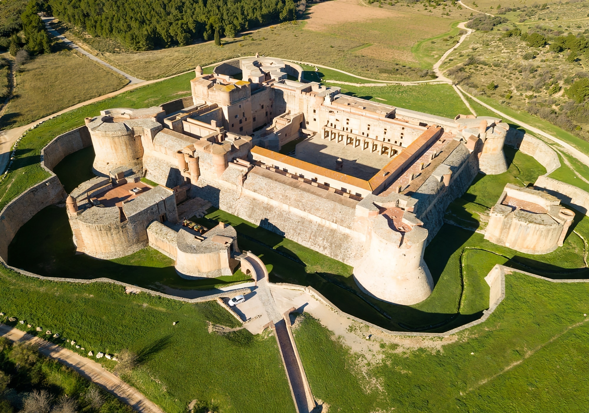

# Le Château de Salses : Une Forteresse Historique

Le **Château de Salses**, situé dans le département des Pyrénées-Orientales, est une forteresse exceptionnelle datant de la fin du XVe siècle. Il a été construit entre 1497 et 1504 par les Espagnols pour défendre la frontière nord du Royaume d'Aragon contre le Royaume de France. Sa position stratégique à l'entrée des Corbières, entre Narbonne et Perpignan, lui conférait un rôle défensif crucial.

## Une Architecture Innovante

Le Château de Salses est un exemple unique d'architecture militaire de transition entre le château médiéval et la fortification bastionnée de la Renaissance. Il se distingue par ses murs massifs, ses bastions avancés, et ses remparts parfaitement adaptés à l’artillerie. Sa forme compacte et ses fossés profonds en font une véritable forteresse imprenable à l'époque de sa construction.

### Caractéristiques principales :
- **Bastions** : Des angles fortifiés avec des plateformes pour l'artillerie.
- **Épaisseur des murs** : Les murs du château atteignent parfois jusqu'à 10 mètres d'épaisseur.
- **Fossés** : L'édifice est entouré de fossés profonds, renforçant son caractère défensif.
- **Casemates** : Des pièces souterraines voûtées pour abriter les soldats et les stocks de munitions.

## L'Histoire du Château

Le Château de Salses a joué un rôle majeur dans les guerres franco-espagnoles au XVIe et XVIIe siècles. Il a été le théâtre de plusieurs sièges, dont celui de 1642, qui marqua la prise du château par les Français. Suite au traité des Pyrénées en 1659, qui déplaça la frontière plus au sud, la forteresse perdit son importance stratégique et fut progressivement abandonnée.

Aujourd'hui, le château est un monument historique classé et est ouvert au public. Il est géré par le Centre des monuments nationaux et attire chaque année des milliers de visiteurs fascinés par son architecture et son histoire.

## Visiter le Château

Le Château de Salses est une destination incontournable pour les amateurs d'histoire et d'architecture militaire. Les visites permettent de découvrir l'intérieur du château, avec ses vastes salles voûtées, ses casernes et ses souterrains. Le château offre également une vue panoramique sur les paysages environnants, des Corbières à la plaine du Roussillon.

### Informations pratiques :
- **Adresse** : Route Nationale 9, 66600 Salses-le-Château, France
- **Horaires** : Le château est ouvert tous les jours, sauf certains jours fériés. Il est recommandé de vérifier les horaires d'ouverture sur le site officiel.
- **Tarifs** : Le prix d'entrée est modeste, avec des réductions pour les jeunes et les groupes scolaires.
  
## Conclusion

Le **Château de Salses** est un joyau de l'architecture militaire, témoin de siècles de conflits entre la France et l'Espagne. Sa visite permet de se plonger dans l'histoire complexe de la région tout en admirant une forteresse superbement préservée. Une visite s'impose si vous êtes dans la région !

**Sources** :
- Centre des monuments nationaux.
- Histoire et patrimoine local.
